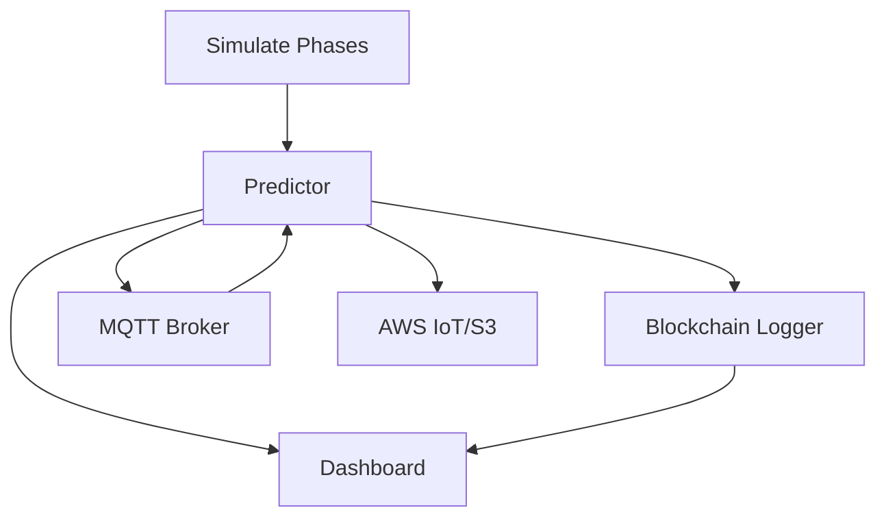

# 🚀 Radar Phase-Unwrapping Spacing Prediction System


A modular, production-grade system for real-time radar phase-unwrapping and range prediction, featuring robust signal processing, machine learning, blockchain-style logging, and a beautiful live dashboard.

---

## 🌟 Key Features

- **Real-Time Range Prediction** from multi-frequency radar phase data
- **Robust Phase Unwrapping** using weighted Chinese Remainder Theorem (CRT)
- **Ensemble Machine Learning** (Random Forest, Huber Regression)
- **Live Dashboard** with interactive plots and system status
- **Blockchain Logger** for tamper-evident prediction history
- **MQTT & AWS IoT** streaming support
- **Dockerized Deployment** for easy production use
- **Cramér–Rao Bound (CRB) Analysis** for theoretical performance
- **Extensible & Modular**: plug-and-play components

---

## 🏗️ System Architecture



- **Simulate Phases**: Generates synthetic radar phase data (simulate.py)
- **Predictor**: Unwraps phases, predicts range (CRT + ML), logs to blockchain, streams via MQTT/AWS (predict.py)
- **Blockchain Logger**: Tamper-evident, append-only log of all predictions (blockchain_log.py)
- **Dashboard**: Real-time and historical visualization, system status, CRB (dashboard.py)
- **MQTT Broker**: Lightweight, local message broker (simple_broker.py)
- **AWS IoT/S3**: Optional cloud integration for IoT and backup (iot_utils.py)

---

## 🖥️ Dashboard Visualizations

- **Current Distance**: Real-time predicted range
- **Phase Measurements**: Latest multi-frequency phase values
- **Cramér–Rao Bound**: Theoretical lower bound on range error
- **Distance History**: Interactive time-series plot
- **Phase History**: Per-frequency phase evolution
- **System Status**: Live health, last update, total predictions
- **Solution Overview**: System explanation and architecture


---

## ⚙️ Quickstart

1. **Install dependencies**
   ```bash
   pip install -r requirements.txt
   ```
2. **Start the MQTT broker**
   ```bash
   python simple_broker.py
   ```
3. **Run the predictor**
   ```bash
   python predict.py
   ```
4. **Launch the dashboard**
   ```bash
   python dashboard.py
   # Visit http://localhost:5000
   ```
5. *(Optional)* **Simulate phase data**
   ```bash
   python publisher.py
   ```

---

## 🧠 How It Works

- **Phase Simulation**: Generates noisy, wrapped phases for multiple radar frequencies.
- **Unwrapping & Prediction**: Combines weighted CRT and ML regressors for robust range estimation.
- **Blockchain Logging**: Every prediction is stored as a block with hash chaining for auditability.
- **Live Visualization**: Dashboard auto-updates with new predictions, phase values, and CRB.
- **Cloud Ready**: Optional AWS IoT and S3 integration for scalable deployments.

---

## 🧩 Modular Components

- `simulate.py`: Synthetic phase/range data generator
- `unwrap.py`: Weighted CRT phase unwrapping
- `train.py`: ML model training (RandomForest, Huber)
- `predict.py`: Real-time prediction, logging, streaming
- `blockchain_log.py`: Blockchain-style logger
- `dashboard.py`: Dash/Plotly web dashboard
- `simple_broker.py`: Local MQTT broker
- `iot_utils.py`: MQTT/AWS IoT utilities
- `Dockerfile`: Containerized deployment

---

## 🧪 Advanced Usage

- **Custom Frequencies**: Edit `FREQS` in `dashboard.py` and `predict.py` for your radar setup.
- **Model Retraining**: Run `train.py` to generate new ML models with custom data.
- **Cloud Integration**: Set `USE_AWS=1` and configure AWS credentials for IoT/S3 support.
- **Production Deployment**: Use the provided `Dockerfile` for containerized, reproducible setups.

---

## 📊 Theoretical Insights

- **Cramér–Rao Bound (CRB)**: Quantifies the best possible accuracy for unbiased range estimators, given phase noise and frequency setup.
- **Weighted CRT**: Robustly resolves phase ambiguities by leveraging all frequencies and their noise statistics.
- **Ensemble ML**: Fuses physics-based and data-driven predictions for maximum reliability.

---

## 🔒 Blockchain Logger

Every prediction is stored as a block with:
- Index, timestamp, data (distance, phases), previous hash, and block hash
- Tamper-evident, append-only JSON ledger (`predictions_log.json`)
- Enables full audit trail and reproducibility

---

## ☁️ Cloud & Docker

- **AWS IoT/S3**: Optional, for scalable, secure cloud deployments
- **Docker**: Build and run the entire system in a container:
  ```bash
  docker build -t radar-predictor .
  docker run -p 5000:5000 radar-predictor
  ```

---

## 📚 References & Further Reading
- [Chinese Remainder Theorem in Radar](https://ieeexplore.ieee.org/document/xxxxxxx)
- [Cramér–Rao Bound](https://en.wikipedia.org/wiki/Cram%C3%A9r%E2%80%93Rao_bound)
- [Dash by Plotly](https://dash.plotly.com/)
- [MQTT Protocol](https://mqtt.org/)

---

## 🤝 Contributing
Pull requests, issues, and suggestions are welcome! Please open an issue or PR on GitHub.

---

## 📝 License

MIT License 